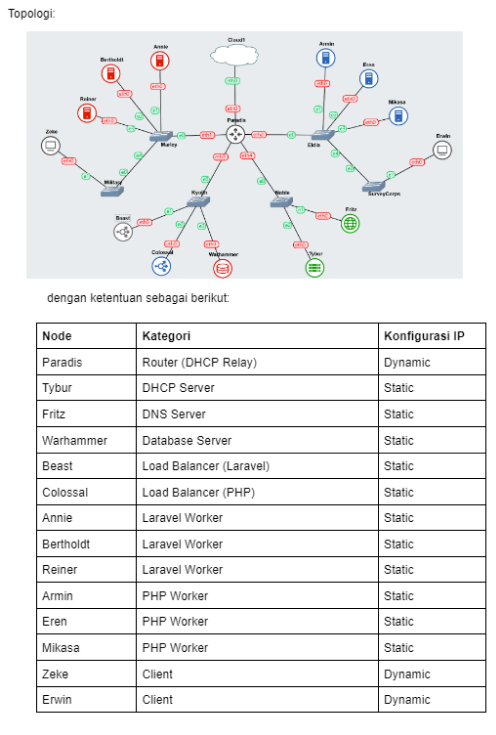

# Jarkom-Modul-3-IT16-2024

# Anggota

| Nama                            | NRP          |
| ------------------------------- | ------------ |
| Zidny Ilman Nafi'an | `5027221072` |
| MUHAMMAD DZAKWAN | `5027201065` |


# Setup Topologi


Buat topologi seperti di atas sesuai dengan yang ditentukan.


Network Configuration tiap node seperti di bawah ini:

## Router

### Paradis
```
auto eth0
iface eth0 inet dhcp

auto eth1
iface eth1 inet static
	address 192.241.1.1
	netmask 255.255.255.0

auto eth2
iface eth2 inet static
	address 192.241.2.1
	netmask 255.255.255.0

auto eth3
iface eth3 inet static
	address 192.241.3.1
	netmask 255.255.255.0

auto eth4
iface eth4 inet static
	address 192.241.4.1
	netmask 255.255.255.0
```

### Annie

```
auto eth0
iface eth0 inet static
	address 192.241.1.2
	netmask 255.255.255.0
	gateway 192.241.1.1
```

### Bertholdt

```
auto eth0
iface eth0 inet static
	address 192.241.1.3
	netmask 255.255.255.0
	gateway 192.241.1.1
```

### Reiner

```
auto eth0
iface eth0 inet static
	address 192.241.1.4
	netmask 255.255.255.0
	gateway 192.241.2.1
```

### Zeke

```
auto eth0
iface eth0 inet static
	address 192.241.1.5
	netmask 255.255.255.0
	gateway 192.241.2.1
```

### Beast

```
auto eth0
iface eth0 inet static
	address 192.241.2.2
	netmask 255.255.255.0
	gateway 192.241.2.1
```

### Colossal
```
auto eth0
iface eth0 inet static
	address 192.241.2.3
	netmask 255.255.255.0
	gateway 192.241.2.1
```

### Warhammer

```
auto eth0
iface eth0 inet static
	address 192.241.2.4
	netmask 255.255.255.0
	gateway 192.241.2.1
```

### Tybur

```
auto eth0
iface eth0 inet static
	address 192.241.3.2
	netmask 255.255.255.0
	gateway 192.241.3.1
```

### Fritz

```
auto eth0
iface eth0 inet static
	address 192.241.3.3
	netmask 255.255.255.0
	gateway 192.241.3.1
```

### Erwin

```
auto eth0
iface eth0 inet static
	address 192.241.4.2
	netmask 255.255.255.0
	gateway 192.241.4.1
```

### Mikasa

```
auto eth0
iface eth0 inet static
	address 192.241.4.3
	netmask 255.255.255.0
	gateway 192.241.4.1
```

### Eren

```
auto eth0
iface eth0 inet static
	address 192.241.4.4
	netmask 255.255.255.0
	gateway 192.241.4.1
```

### Armin

```
auto eth0
iface eth0 inet static
	address 192.241.4.5
	netmask 255.255.255.0
	gateway 192.241.4.1
```

# Konfigurasi Jaringan Kaum Marley dan Eldia

## 1. Konfigurasi DHCP Server (Tybur)
- Client yang melalui bangsa Marley mendapatkan range IP dari `[prefix IP].1.05 - [prefix IP].1.25` dan `[prefix IP].1.50 - [prefix IP].1.100`.
- Client yang melalui bangsa Eldia mendapatkan range IP dari `[prefix IP].2.09 - [prefix IP].2.27` dan `[prefix IP].2.81 - [prefix IP].2.243`.
- DNS Server diarahkan ke keluarga Fritz, sehingga client dapat terhubung ke internet.
- Lease time untuk bangsa Eldia diatur selama 6 menit, dan untuk bangsa Marley selama 30 menit, dengan maksimum 87 menit.
   - Instalasi DHCP server:
     ```bash
     sudo apt update
     sudo apt install isc-dhcp-server -y
     ```

   - Edit konfigurasi di `/etc/dhcp/dhcpd.conf` untuk menetapkan range IP:
     ```bash
     # File: /etc/dhcp/dhcpd.conf

     default-lease-time 1800; # Untuk kaum Marley (30 menit)
     max-lease-time 5220;     # Waktu maksimal (87 menit)
     option domain-name-servers [IP Fritz];

     # Subnet Kaum Marley
     subnet [prefix IP].1.0 netmask 255.255.255.0 {
       range [prefix IP].1.5 [prefix IP].1.25;
       range [prefix IP].1.50 [prefix IP].1.100;
       default-lease-time 1800;
     }

     # Subnet Kaum Eldia
     subnet [prefix IP].2.0 netmask 255.255.255.0 {
       range [prefix IP].2.9 [prefix IP].2.27;
       range [prefix IP].2.81 [prefix IP].2.243;
       default-lease-time 360;  # 6 menit
     }
     ```

   - Restart DHCP server:
     ```bash
     sudo systemctl restart isc-dhcp-server
     ```

## 2. Konfigurasi DNS Server (Fritz)
   - Instalasi DNS server:
     ```bash
     sudo apt update
     sudo apt install bind9 -y
     ```

   - Edit `/etc/bind/named.conf.options` untuk menambahkan forwarding DNS:
     ```bash
     options {
       directory "/var/cache/bind";
       forwarders { 8.8.8.8; };
       dnssec-validation auto;
       listen-on-v6 { any; };
     };
     ```

   - Restart DNS server:
     ```bash
     sudo systemctl restart bind9
     ```

## 3. Deployment Docker Image untuk Kaum Eldia
   - Install dan jalankan kontainer:
     ```bash
     sudo apt update
     sudo apt install docker.io -y
     sudo systemctl start docker
     sudo docker pull danielcristh0/debian-buster:1.1
     sudo docker run -d --name EldiaWorker danielcristh0/debian-buster:1.1
     ```

## 4. Konfigurasi Virtual Host untuk Worker PHP (Armin)
   - Instalasi Apache dan PHP 7.3:
     ```bash
     sudo apt update
     sudo apt install apache2 php7.3 -y
     ```

   - Buat file virtual host di `/etc/apache2/sites-available/eldia.conf`:
     ```bash
     <VirtualHost *:80>
       ServerName bangsaeldia.com
       DocumentRoot /var/www/eldia
       <Directory /var/www/eldia>
         AllowOverride All
       </Directory>
     </VirtualHost>
     ```

   - Aktifkan virtual host dan restart Apache:
     ```bash
     sudo a2ensite eldia.conf
     sudo systemctl restart apache2
     ```

## 5. Testing Load Balancer dengan Apache Benchmark (Colossal)
   - Instalasi Apache Benchmark:
     ```bash
     sudo apt install apache2-utils -y
     ```

   - Jalankan testing:
     ```bash
     ab -n 6000 -c 200 http://colossal_address/
     ab -n 1000 -c 75 http://colossal_address/
     ```

## 6. Menambahkan Keamanan dengan Autentikasi di Colossal
   - Instalasi `htpasswd` dan pembuatan file autentikasi:
     ```bash
     sudo apt install apache2-utils -y
     sudo htpasswd -c /etc/nginx/supersecret/htpasswd arminannie
     ```

   - Edit konfigurasi Nginx di `/etc/nginx/sites-available/colossal.conf` untuk menambahkan autentikasi:
     ```bash
     location / {
       auth_basic "Restricted Access";
       auth_basic_user_file /etc/nginx/supersecret/htpasswd;
     }
     ```

   - Restart Nginx:
     ```bash
     sudo systemctl restart nginx
     ```

## 7. Proxy Passing untuk Endpoint `/titan` di Colossal
   - Tambahkan konfigurasi di Nginx untuk `/titan`:
     ```bash
     location /titan {
       proxy_pass https://attackontitan.fandom.com/wiki/Attack_on_Titan_Wiki;
     }
     ```

   - Restart Nginx:
     ```bash
     sudo systemctl restart nginx
     ```

## 8. Mengatur Akses Khusus ke Warhammer
   - Atur firewall untuk akses IP spesifik:
     ```bash
     sudo iptables -A INPUT -p tcp -s [Annie IP] --dport 3306 -j ACCEPT
     sudo iptables -A INPUT -p tcp -s [Reiner IP] --dport 3306 -j ACCEPT
     sudo iptables -A INPUT -p tcp -s [Berthold IP] --dport 3306 -j ACCEPT
     sudo iptables -A INPUT -p tcp --dport 3306 -j DROP
     ```
---
